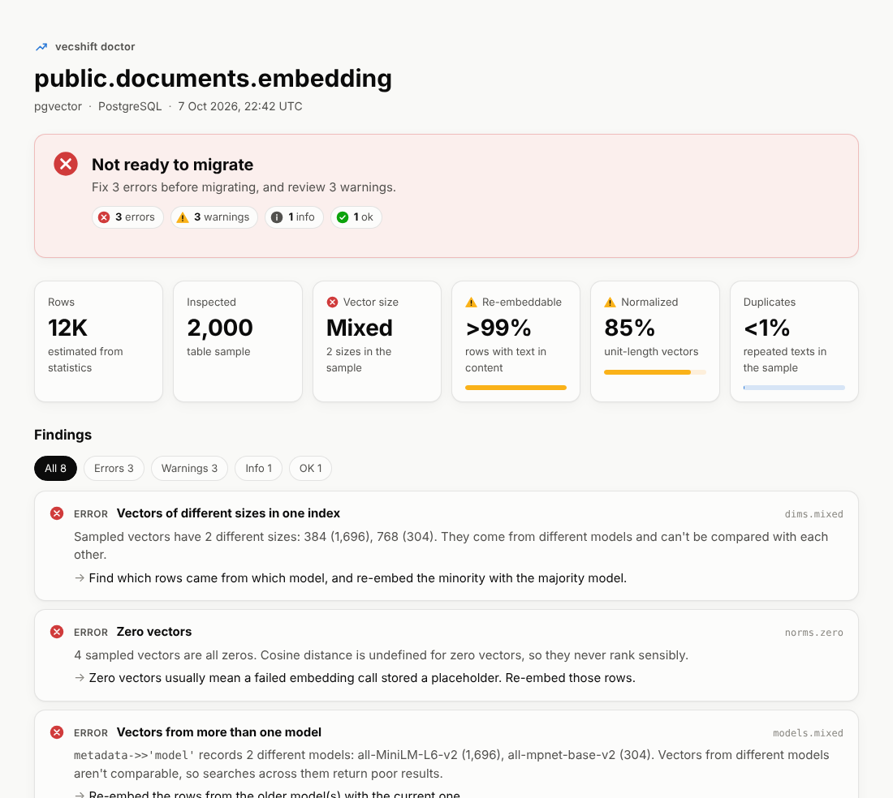

<h1>
  <picture>
    <source media="(prefers-color-scheme: dark)" srcset="docs/images/logo/vecshift-dark.svg">
    
  </picture>
</h1>

**Safe, observable embedding migrations for any vector store, with any embedding model.**

[](https://github.com/Osamamu64/vecshift/actions/workflows/ci.yml)
[](LICENSE)


> [!WARNING]
> VecShift is in early development. The full pgvector workflow works today: `doctor`,
> `bench`, `plan`, `apply`, `eval`, and `cutover`. Watch the repo or read the
> [roadmap](docs/roadmap.md) to follow along.

---

## Why

Every team running RAG or semantic search eventually wants a better or cheaper embedding
model, different dimensions, new chunking, or a different vector store. Today each of those
is a one-off project: a re-embed script, rate-limit workarounds, a new index, a manual
cutover, and no real answer to two questions:

1. **Is the new model actually better on *our* data?**
2. **What's actually in our index right now?** Which model made these vectors? Is it mixed?
   Do we still have the text to re-embed it?

VecShift answers those first, then makes the migration itself safe and repeatable.

## What it will do

| Command | Purpose | Status |
|---|---|---|
| `vecshift fingerprint` | Print a stable tag identifying an embedding configuration's vector space | ✅ Available |
| `vecshift doctor` | Inspect an index: mixed models or sizes, zero and unnormalized vectors, duplicates, missing text, indexing and change-tracking gaps | ✅ pgvector and Supabase |
| `vecshift bench` | Compare embedding models on a sample of *your* data: recall, latency, cost, storage | ✅ Available |
| `vecshift init` / `plan` | Write a migration job, then check it and estimate tokens, cost, time, and storage | ✅ Available |
| `vecshift apply` | Re-embed into a side-by-side column with resume, a spend cap, live-write sync, and a concurrent index build | ✅ pgvector and Supabase |
| `vecshift eval` | Compare old and new vectors on your data, per language, with latency vs accuracy, and a go/no-go verdict | ✅ pgvector and Supabase |
| `vecshift cutover` / `rollback` | Switch searches to the new vectors under the same name, with instant rollback | ✅ pgvector and Supabase |

Initial targets are **pgvector** and **Qdrant**, with an **OpenAI-compatible** embedding
provider (which covers OpenAI, vLLM, Ollama, TEI, and most hosted inference) plus a free
mock provider for trying things out.

## Design principles

- **Look before you leap.** Read-only diagnosis and benchmarking come before any write.
- **Never lose data.** Idempotent upserts guarded by `updated_at`, checkpoints, a dead-letter queue.
- **Know your vector space.** Every vector carries a fingerprint of the model configuration
  that produced it, so mixed or stale vectors are detectable.
- **Data stays home.** Runs inside your network. Nothing leaves except to the embedding
  provider you choose.
- **Free first run.** Mock embeddings and a local store, so you can try it without an API key.

## Quick start (from source)

Requires Python 3.11+ and [uv](https://docs.astral.sh/uv/).

```bash
git clone https://github.com/Osamamu64/vecshift.git
cd vecshift
uv sync
uv run vecshift --help
```

### Check an existing pgvector or Supabase index

`doctor` is read-only and never downloads your vectors, so it's safe against production.

```bash
export VECSHIFT_DSN='postgresql://postgres.<project-ref>:<password>@<region>.pooler.supabase.com:5432/postgres'
uv run vecshift doctor --table public.documents
```

Abridged output:

```text
vecshift doctor · pgvector via Supabase session pooler
Target  public.documents.embedding  vector
Rows    ~1,001 (inspected 1,001, full table)

✖ ERROR    Vectors of different sizes in one index
           Sampled vectors have 2 different sizes: 1536 (901), 3072 (100). They
           come from different models and can't be compared with each other.
✖ ERROR    Vectors from more than one model
           `metadata->>'model'` records 2 different models: text-embedding-ada-002
           (900), text-embedding-3-small (100). ...
⚠ WARNING  No way to track writes during a migration
           There's no logical replication and no updated-at timestamp column, ...
✔ OK       Source text available
           Every sampled row has text in `content`, so the index can be re-embedded.
```

Add `--html report.html` for a shareable dashboard of the same results, `--json` for scripts,
or `--fail-on error` to fail a CI job.

[](docs/images/doctor-report.png)

The HTML report is a single file that works offline and follows your light or dark theme. It
holds statistics only, never vectors or row text, so it's safe to attach to a ticket. See the
[pgvector and Supabase guide](docs/connectors/pgvector.md) for connection strings, row-level
security, and a read-only role recipe.

### Find the best embedding model for your data

```bash
uv run vecshift bench --docs docs.jsonl \
  -m openai/text-embedding-3-small -m openai/text-embedding-3-large,dims=256 \
  -m ollama/nomic-embed-text --html leaderboard.html
```

It samples your documents (from a JSONL file or a pgvector table), builds queries with
known answers, and ranks each model by retrieval quality, query latency, cost per million
documents, and storage. It asks before sending anything to a paid API, and caches
embeddings so re-runs are cheap. Run it with no `-m` for a free, offline first try. See
the [benchmarking guide](docs/bench.md).

### Plan a migration

```bash
uv run vecshift init --table public.documents --model openai/text-embedding-3-large,dims=1024
uv run vecshift plan
```

`init` writes a commented `vecshift.yaml`. `plan` checks it against the database without
changing anything: the SQL it would run, rows, tokens, cost, duration, and storage, plus
anything that would make the migration fail.

### Run it

```bash
uv run vecshift apply
```

`apply` adds the new column next to the old one, embeds every row, and builds the index
concurrently, while your application keeps reading and writing. It stops cleanly on
Ctrl-C, at your budget, or part way with `--until 50`, and running it again resumes.

```bash
uv run vecshift eval              # better on your data, and how fast? GO / NO-GO
uv run vecshift cutover --check   # safe to switch?
uv run vecshift cutover           # searches use the new vectors, under the same column name
uv run vecshift rollback          # undo, instantly
```

Your application's SQL doesn't change: cutover gives the new vectors the column name it
already uses, in one transaction. Switch the model your app embeds queries with at the
same time. See [Running a migration](docs/migrations.md) and
[Evaluating a migration](docs/eval.md).

#### Tested at scale

The full workflow has been run on a **2-million-row** table (PostgreSQL 17, 4 vCPUs, 15 GB
of RAM) while an application kept updating and inserting rows about 14 times a second:

| Step | Time | Application writes meanwhile |
|---|---|---|
| `apply`: embed 2 million rows | depends on your embedding model and its rate limits | 60K+ writes, p99 36 ms, no errors |
| `apply`: catch up and build the HNSW index | 4.6 min | p99 33 ms, no errors |
| `cutover`, including rows changed during the run | 30 s | longest pause 0.29 s |
| `rollback` | 1.7 s | longest pause 0.99 s |
| `eval`, 200 queries | 29 s | p99 13 ms |

Details in [Running a migration](docs/migrations.md#at-scale).

### Fingerprint an embedding configuration

Get the fingerprint of an embedding configuration:

```console
$ uv run vecshift fingerprint --provider openai --model text-embedding-3-small --dimensions 1536
openai/text-embedding-3-small@1536#a3ac94a82eca
```

Any change to the provider, model, dimensions, version, task type, prefix, or normalization
produces a different tag, because it's a different vector space.

## Documentation

- [Running a migration](docs/migrations.md): the job file, `plan`, `apply`, `cutover`, and `rollback`
- [Evaluating a migration](docs/eval.md): quality per language, latency vs accuracy, and the verdict
- [Benchmarking embedding models](docs/bench.md): sources, model specs, query types, and metrics
- [pgvector and Supabase](docs/connectors/pgvector.md): connecting, what `doctor` checks, and safety
- [Architecture](docs/architecture.md): the canonical record, plugin contracts, and capability flags
- [Roadmap](docs/roadmap.md): what's being built, in what order, and why
- [Security model](docs/security.md): what vecshift sends, stores, and touches
- [Prior art](docs/prior-art.md): related tools and how VecShift relates to them

## Contributing

Contributions are welcome, especially new connectors and embedding providers once the
contracts settle. Start with [CONTRIBUTING.md](CONTRIBUTING.md). Everyone taking part is
expected to follow the [Code of Conduct](CODE_OF_CONDUCT.md).

To report a security issue, see [SECURITY.md](SECURITY.md). Please don't open a public issue.

## License

Licensed under the [Apache License 2.0](LICENSE).
